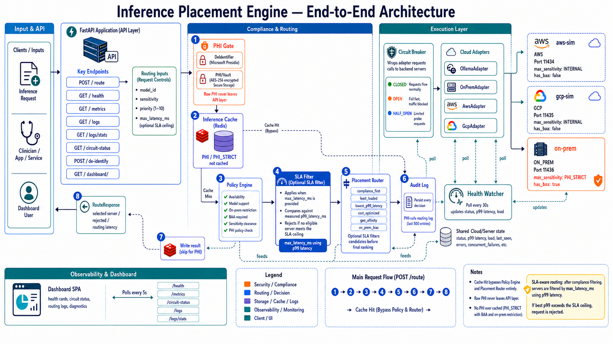

# inference-placement-engine

A HIPAA-aware inference placement router that selects the best cloud or on-premises server for each ML inference request based on compliance rules, latency, cost, and load.

---


*Live dashboard showing 18 routed requests — aws-sim (p99 6.4 ms) and on-prem (p99 7.9 ms) healthy, gcp-sim unavailable (p99 886.9 ms from timeout). Avg routing decision time 0.207 ms.*

---

## Problem

Healthcare ML workloads span a spectrum of data sensitivity. A de-identified risk-scoring model can run on any public cloud, but a request containing full PHI must never leave a HIPAA-compliant environment with a signed BAA. Manually enforcing these rules across AWS, GCP, and on-prem clusters is error-prone and slows down both engineering and compliance teams.

This engine solves that by making placement policy-driven and automatic:

- Every request carries a sensitivity tier (`public` → `phi_strict`).
- Every server declares its compliance clearance, BAA status, and supported models.
- The router enforces HIPAA rules first, then optimises for latency, cost, or load.

---

## Architecture



*Complete system showing PHI gate, policy filtering, SLA-aware routing with p99 latency, and multi-cloud execution*

```
Client
  │
  ▼
FastAPI app  (src/api/main.py)
  │
  ├── PlacementRouter  (src/engine/router.py)
  │     ├── PolicyEngine   — compliance + model-support filtering
  │     └── Scoring        — least-loaded / latency / cost / round-robin
  │
  ├── HealthWatcher  (src/engine/health.py)
  │     └── Background threads poll each adapter's health endpoint
  │
  └── Cloud adapters  (src/clouds/)
        ├── OnPremAdapter   — vLLM OpenAI-compatible API
        ├── OllamaAdapter   — Ollama (uses /api/tags for health)
        ├── CloudAdapter    — abstract base
        ├── AwsAdapter      — AWS-specific adapter
        └── GcpAdapter      — GCP-specific adapter
```

**Demo topology** (`scripts/start_demo.sh` starts three local Ollama processes):

| Simulated env | Port  | Model           | max_sensitivity | has_baa |
|---------------|-------|-----------------|-----------------|---------|
| aws-sim       | 11434 | tinyllama:latest | INTERNAL        | false   |
| gcp-sim       | 11435 | tinyllama:latest | INTERNAL        | false   |
| on-prem       | 11436 | tinyllama:latest | PHI_STRICT      | true    |

---

## What This Implements

Each feature in this engine maps directly to concepts covered in these articles:

| Feature | Article |
|---------|---------|
| HIPAA-aware routing — PHI detection, sensitivity tiers, BAA enforcement | [*Link to your Medium article*](#) |
| p99 latency tracking and SLA-aware server filtering | [*Link to your Medium article*](#) |
| Multi-cloud placement with compliance-first policy engine | [*Link to your Medium article*](#) |
| Redis-backed inference result cache with PHI gate | [*Link to your Medium article*](#) |
| Circuit breaker pattern for adapter fault tolerance | [*Link to your Medium article*](#) |
| PHI de-identification pipeline with entity vault | [*Link to your Medium article*](#) |

> Replace the placeholder links above with your published Medium article URLs.

---

## Prerequisites

### All platforms

- **Python 3.11+**
- **[Ollama](https://ollama.com)** — runs local LLM inference
- **Git**
- **Redis** (optional — caching is disabled gracefully if unavailable)

### macOS

```bash
# Install Homebrew if not already installed
/bin/bash -c "$(curl -fsSL https://raw.githubusercontent.com/Homebrew/install/HEAD/install.sh)"

brew install python@3.11 git redis
brew install --cask ollama
```

### Linux (Ubuntu / Debian)

```bash
sudo apt update
sudo apt install -y python3.11 python3.11-venv python3-pip git curl redis-server

# Install Ollama
curl -fsSL https://ollama.com/install.sh | sh
```

### Windows (WSL2 recommended)

1. Install [WSL2](https://learn.microsoft.com/en-us/windows/wsl/install) with Ubuntu:
   ```powershell
   wsl --install
   ```
2. Open the Ubuntu terminal and follow the **Linux** instructions above.
3. Install [Ollama for Windows](https://ollama.com/download/windows) natively, or run it inside WSL2.

> Native Windows (PowerShell without WSL) is not supported — the demo scripts use bash.

### Chromebook (Linux via Crostini)

1. Enable Linux: **Settings → Advanced → Developers → Linux development environment → Turn On**
2. Open the Linux terminal and follow the **Linux (Ubuntu / Debian)** instructions above.

---

## Setup

### 1. Clone and install dependencies

```bash
git clone https://github.com/PreethiAndichamy342/inference-placement-engine.git
cd inference-placement-engine
pip install -r requirements.txt
```

### 2. Pull the demo model

```bash
ollama pull tinyllama
```

### 3. (Optional) Start Redis

Caching is disabled gracefully if Redis is unavailable, but enabling it gives you routing result caching for non-PHI requests.

**macOS:**
```bash
brew services start redis
```

**Linux / Chromebook:**
```bash
sudo service redis-server start
```

**Windows (WSL2):**
```bash
sudo service redis-server start
```

### 4. Start three simulated cloud environments

```bash
bash scripts/start_demo.sh
```

Expected output:
```
[aws]    PID XXXX on port 11434
[gcp]    PID XXXX on port 11435
[onprem] PID XXXX on port 11436
Model: tinyllama:latest available on all instances.
```

### 5. Start the placement engine

```bash
export PATH="$HOME/.local/bin:$PATH"
uvicorn src.api.main:app --reload --port 8000
```

### 6. Verify everything is running

```bash
curl -s http://localhost:8000/health | python3 -m json.tool
```

Expected:
```json
{
  "status": "ok",
  "healthy_server_count": 3,
  "total_server_count": 3,
  "checked_at": "..."
}
```

Browse the interactive API docs at **http://localhost:8000/docs**  
Browse the live dashboard at **http://localhost:8000/dashboard**

### 7. Stop demo instances when done

```bash
bash scripts/stop_demo.sh
```

---

## API endpoints

### `GET /health`

Returns app liveness and the count of healthy servers.

```json
{
  "status": "ok",
  "healthy_server_count": 3,
  "total_server_count": 3,
  "checked_at": "2026-05-05T16:55:55Z"
}
```

Returns `status: degraded` (still HTTP 200) when no servers are healthy, so load-balancer health checks don't immediately pull the instance.

---

### `GET /metrics`

Returns a snapshot of load, latency, cost, and status for every registered server.

```json
{
  "servers": [
    {
      "server_id": "on-prem-01",
      "cloud_env": "on_prem",
      "region": "local",
      "status": "healthy",
      "current_load": 0.0,
      "p99_latency_ms": 0.0,
      "cost_per_token": 0.0,
      "gpu_count": 1,
      "gpu_type": "A100"
    }
  ],
  "collected_at": "2026-05-05T16:55:55Z"
}
```

---

### `POST /route`

Routes an inference request to the best eligible server.

**Request body:**

| Field              | Type   | Required | Description |
|--------------------|--------|----------|-------------|
| `model_id`         | string | yes      | Model to invoke, e.g. `"tinyllama:latest"` |
| `payload`          | object | yes      | Input passed verbatim to the inference server |
| `tenant_id`        | string | yes      | Identifier of the requesting organisation |
| `data_sensitivity` | string | no       | `public` / `internal` / `sensitive` / `phi` / `phi_strict` (default: `internal`) |
| `strategy`         | string | no       | `compliance_first` / `least_loaded` / `latency_optimized` / `cost_optimized` / `round_robin` (default: `compliance_first`) |
| `task_type`        | string | no       | `general` / `clinical_nlp` / `medical_imaging` / `risk_scoring` / etc. |
| `max_latency_ms`   | float  | no       | Soft SLA ceiling — servers with p99 above this are excluded |
| `priority`         | int    | no       | 1–10, higher = more important (default: 5) |
| `region_hint`      | string | no       | Preferred cloud region hint |
| `metadata`         | object | no       | Arbitrary key-value metadata passed through to the log |

**Example — public request:**

```bash
curl -X POST http://localhost:8000/route \
  -H "Content-Type: application/json" \
  -d '{
    "model_id": "tinyllama:latest",
    "payload": {"prompt": "What is diabetes?"},
    "tenant_id": "hospital_A",
    "data_sensitivity": "public",
    "strategy": "least_loaded"
  }'
```

**Example — PHI request:**

```bash
curl -X POST http://localhost:8000/route \
  -H "Content-Type: application/json" \
  -d '{
    "model_id": "tinyllama:latest",
    "payload": {"prompt": "Patient John DOB 1980 has hypertension"},
    "tenant_id": "hospital_A",
    "data_sensitivity": "phi_strict",
    "strategy": "compliance_first"
  }'
```

**Example — high-priority stat request with SLA ceiling:**

```bash
curl -X POST http://localhost:8000/route \
  -H "Content-Type: application/json" \
  -d '{
    "model_id": "tinyllama:latest",
    "payload": {"prompt": "Rapid sepsis risk score for ICU patient"},
    "tenant_id": "hospital_A",
    "data_sensitivity": "sensitive",
    "strategy": "latency_optimized",
    "priority": 9,
    "max_latency_ms": 500
  }'
```

The router runs compliance filtering first, then drops any server whose `p99_latency_ms` exceeds `max_latency_ms`. If no server survives the SLA cut, the request is rejected with HTTP 503 and a message showing the best available p99 so the caller knows how far off the ceiling they are.

**Response:**

```json
{
  "request_id": "7de10d69-...",
  "rejected": false,
  "strategy_used": "compliance_first",
  "selected_server": {
    "server_id": "on-prem-01",
    "cloud_env": "on_prem",
    "region": "local",
    "endpoint": "http://localhost:11436/v1/completions",
    "status": "healthy"
  },
  "candidate_count": 1,
  "score_breakdown": {
    "on-prem-01": {"current_load": 0.0, "p99_latency_ms": 0.0, "cost_per_token": 0.0, "gpu_count": 1.0}
  },
  "routing_latency_ms": 0.156,
  "phi_entities_detected": 0,
  "decided_at": "2026-05-05T16:55:55Z"
}
```

---

### `POST /de-identify`

De-identifies free text and returns the anonymised version with a per-type entity breakdown. The entity map (token → original value) is **not** returned — it is stored securely in PHIVault keyed by `request_id` when routing via `POST /route`.

**Request body:**

| Field  | Type   | Required | Description |
|--------|--------|----------|-------------|
| `text` | string | yes      | Free text to de-identify |

**Example:**

```bash
curl -X POST http://localhost:8000/de-identify \
  -H "Content-Type: application/json" \
  -d '{"text": "Patient Jane Smith, DOB 1985-03-12, SSN 123-45-6789"}'
```

**Response:**

```json
{
  "anonymized_text": "Patient <PERSON>, DOB <DATE>, SSN <US_SSN>",
  "entity_count": 3,
  "entities_by_type": {"PERSON": 1, "DATE": 1, "US_SSN": 1}
}
```

---

### `GET /logs`

Queries the in-memory routing decision log (last 500 entries). No payload or PHI text is ever stored.

**Query parameters:**

| Parameter     | Type    | Description |
|---------------|---------|-------------|
| `sensitivity` | string  | Filter by `data_sensitivity` tier |
| `tenant_id`   | string  | Filter by exact tenant ID |
| `cloud_env`   | string  | Filter by cloud environment |
| `rejected`    | boolean | `true` = rejected only, `false` = accepted only |
| `limit`       | int     | Max entries to return, 1–500 (default: 50) |
| `search`      | string  | Case-insensitive match on `request_id` or `tenant_id` |

**Example:**

```bash
curl "http://localhost:8000/logs?sensitivity=phi_strict&limit=10"
```

---

### `GET /logs/stats`

Returns aggregated counts from the routing log grouped by `data_sensitivity` and `cloud_env`.

```bash
curl http://localhost:8000/logs/stats
```

**Response:**

```json
{
  "total": 42,
  "rejected_count": 2,
  "by_sensitivity": {"public": 18, "phi_strict": 12, "internal": 12},
  "by_cloud_env": {"on_prem": 14, "aws": 16, "gcp": 12}
}
```

---

### `GET /circuit-status`

Returns the circuit breaker state for all registered servers: `CLOSED` (normal), `OPEN` (fast-failing), or `HALF_OPEN` (probing).

```bash
curl http://localhost:8000/circuit-status
```

**Response:**

```json
{
  "servers": [
    {
      "server_id": "aws-sim",
      "state": "CLOSED",
      "consecutive_failures": 0,
      "failure_threshold": 3,
      "last_failure_time": null
    }
  ],
  "collected_at": "2026-05-05T16:55:55Z"
}
```

---

### `GET /test-prompts`

Returns fabricated sample prompts for each sensitivity tier, suitable for exercising the de-identification pipeline and routing logic from the dashboard. All PHI in `phi` and `phi_strict` tiers is entirely fabricated.

```bash
curl http://localhost:8000/test-prompts
```

---

### `GET /health-check/{server_id}`

Directly probes a server's health endpoint and returns the result with timing. Does **not** update the server's persisted status.

```bash
curl http://localhost:8000/health-check/aws-sim
```

**Response:**

```json
{
  "server_id": "aws-sim",
  "status": "healthy",
  "latency_ms": 4.231,
  "error": null,
  "checked_at": "2026-05-05T16:55:55Z"
}
```

---

### `GET /server-logs/{server_id}`

Returns routing log entries that were dispatched to a specific server, newest first.

**Query parameters:**

| Parameter | Type | Description |
|-----------|------|-------------|
| `limit`   | int  | Max entries to return, 1–200 (default: 20) |

```bash
curl "http://localhost:8000/server-logs/on-prem-01?limit=5"
```

---

### `POST /force-health-poll/{server_id}`

Triggers an immediate health check and updates the server's persisted status. Use this to force a recovery check without waiting for the next background poll interval (default: 30 s).

```bash
curl -X POST http://localhost:8000/force-health-poll/gcp-sim
```

**Response:**

```json
{
  "server_id": "gcp-sim",
  "previous_status": "unavailable",
  "new_status": "healthy",
  "latency_ms": 3.812,
  "polled_at": "2026-05-05T16:55:55Z"
}
```

---

## How PHI routing works

Requests are filtered and scored in two phases:

### Phase 1 — Compliance filtering (always runs first)

The `PolicyEngine` eliminates servers that fail any of these checks:

| Check           | Rule |
|-----------------|------|
| Model support   | Server must list the requested `model_id` in its `supported_models` |
| Sensitivity     | Server's `max_sensitivity` must be ≥ request's `data_sensitivity` |
| BAA requirement | Requests with `sensitive`, `phi`, or `phi_strict` data require `has_baa=True` |
| On-prem only    | `phi_strict` requests are restricted to `cloud_env=ON_PREM` servers |

A request is rejected with HTTP 503 if no server passes all four checks.

### Phase 2 — Scoring (strategy-dependent)

Servers that pass Phase 1 are ranked by the chosen strategy:

| Strategy            | Ranking criterion |
|---------------------|-------------------|
| `compliance_first`  | Highest `max_sensitivity` clearance wins |
| `least_loaded`      | Lowest `current_load` wins |
| `latency_optimized` | Lowest `p99_latency_ms` wins (measured from last 100 requests) |
| `cost_optimized`    | Lowest `cost_per_token` wins |
| `round_robin`       | Cycles through eligible servers in registration order |

### Example: PHI_STRICT request

```
Request: data_sensitivity=phi_strict, strategy=compliance_first

Phase 1 filtering:
  aws-sim  → REJECTED (max_sensitivity=INTERNAL, has_baa=False, cloud_env=AWS)
  gcp-sim  → REJECTED (max_sensitivity=INTERNAL, has_baa=False, cloud_env=GCP)
  on-prem  → PASSES  (max_sensitivity=PHI_STRICT, has_baa=True, cloud_env=ON_PREM)

Phase 2 scoring:
  on-prem  → selected (only eligible candidate)

Result: routed to on-prem, PHI never leaves the compliant environment.
```

---

## Troubleshooting

### `curl: (7) Failed to connect to localhost port 8000`

The API server is not running. Start it with:

```bash
export PATH="$HOME/.local/bin:$PATH"
uvicorn src.api.main:app --reload --port 8000
```

---

### `healthy_server_count: 0` or backends showing unavailable

The demo Ollama instances are not running. Start them:

```bash
bash scripts/start_demo.sh
```

If you see `Demo already running`, stop first:

```bash
bash scripts/stop_demo.sh && bash scripts/start_demo.sh
```

---

### `ModuleNotFoundError` on startup

Dependencies are not installed. Run:

```bash
pip install -r requirements.txt
```

If you have multiple Python versions, ensure you're using Python 3.11+:

```bash
python3 --version
python3 -m pip install -r requirements.txt
```

---

### `ollama pull tinyllama` hangs or fails

- Ensure Ollama is running: open the Ollama app (macOS/Windows) or run `ollama serve` in a separate terminal (Linux).
- Check your internet connection — the model download is ~600 MB.

---

### Redis warnings in server logs

```
cache: Redis unavailable at localhost:6379 — caching disabled
```

This is not an error — caching is disabled gracefully. To enable it, start Redis:

```bash
# macOS
brew services start redis

# Linux / Chromebook / WSL2
sudo service redis-server start
```

---

### Port already in use (`[Errno 98] Address already in use`)

Another process is using port 8000 or one of the Ollama ports (11434–11436). Find and stop it:

```bash
# Find what's using port 8000
lsof -i :8000

# Kill by PID
kill <PID>
```

---

### On Chromebook: `bash: uvicorn: command not found`

Add the local bin directory to your PATH:

```bash
export PATH="$HOME/.local/bin:$PATH"
```

Add this line to `~/.bashrc` to make it permanent.

---

## Future Enhancements

| Enhancement | Description |
|---|---|
| **Real-time system diagnostics** | Port reachability checks, process-level health probes, and auto-fix suggestions (e.g. restart a downed adapter, drain a degraded node) surfaced directly in the dashboard |
| **Kafka event streaming** | Publish every routing decision to a Kafka topic so downstream consumers (audit systems, billing, analytics pipelines) can subscribe without polling the API |
| **Zero-trust authentication** | mTLS between the engine and each inference adapter; SPIFFE/SPIRE workload identity so no long-lived secrets are needed in the deployment environment |
| **EHR connector (FHIR R4 / HL7 v2)** | Accept inference requests expressed as FHIR `Task` resources or HL7 ADT/ORU messages and translate them into the engine's internal routing schema |
| **Real cloud deployment** | Replace the local Ollama simulation with vLLM endpoints running on actual AWS (EC2 / EKS) and GCP (GKE / Cloud Run) nodes, with Terraform modules for provisioning |
| **Grafana + Prometheus metrics export** | Expose a `/metrics` Prometheus scrape endpoint and ship a Grafana dashboard JSON for routing latency histograms, rejection rates, and PHI entity counts per tenant |
| **Alert routing** | Push status-change events to PagerDuty (on-call escalation) and Slack (channel notifications) when a server goes unavailable or a circuit breaker opens |
