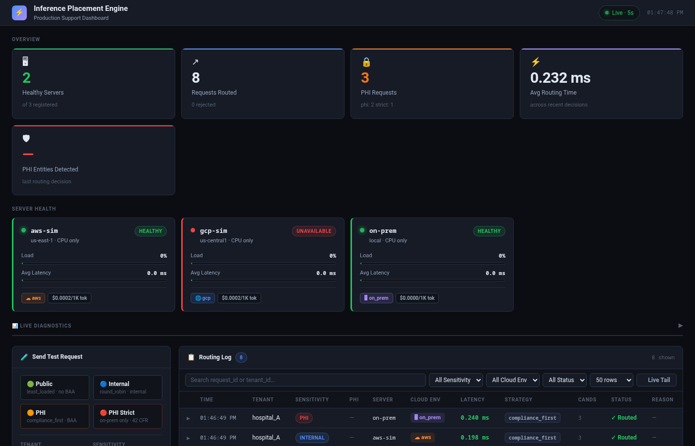

# inference-placement-engine

A HIPAA-aware inference placement router that selects the best cloud or on-premises server for each ML inference request based on compliance rules, latency, cost, and load.

---



*Live dashboard showing 8 routed requests across public, internal, and PHI tiers — aws-sim and on-prem healthy, gcp-sim unavailable, avg routing time 0.232 ms.*

---

## Problem

Healthcare ML workloads span a spectrum of data sensitivity. A de-identified risk-scoring model can run on any public cloud, but a request containing full PHI must never leave a HIPAA-compliant environment with a signed BAA. Manually enforcing these rules across AWS, GCP, and on-prem clusters is error-prone and slows down both engineering and compliance teams.

This engine solves that by making placement policy-driven and automatic:

- Every request carries a sensitivity tier (`public` → `phi_strict`).
- Every server declares its compliance clearance, BAA status, and supported models.
- The router enforces HIPAA rules first, then optimises for latency, cost, or load.

---

## Architecture

```
Client
  │
  ▼
FastAPI app  (src/api/main.py)
  │
  ├── PlacementRouter  (src/engine/router.py)
  │     ├── PolicyEngine   — compliance + model-support filtering
  │     └── Scoring        — least-loaded / latency / cost / round-robin
  │
  ├── HealthWatcher  (src/engine/health.py)
  │     └── Background threads poll each adapter's health endpoint
  │
  └── Cloud adapters  (src/clouds/)
        ├── OnPremAdapter   — vLLM OpenAI-compatible API
        ├── OllamaAdapter   — Ollama (uses /api/tags for health)
        ├── CloudAdapter    — abstract base
        ├── AwsAdapter      — AWS-specific adapter
        └── GcpAdapter      — GCP-specific adapter
```

**Demo topology** (`scripts/start_demo.sh` starts three local Ollama processes):

| Simulated env | Port  | Model           | max_sensitivity | has_baa |
|---------------|-------|-----------------|-----------------|---------|
| aws-sim       | 11434 | tinyllama:latest | INTERNAL        | false   |
| gcp-sim       | 11435 | tinyllama:latest | INTERNAL        | false   |
| on-prem       | 11436 | tinyllama:latest | PHI_STRICT      | true    |

---

## Quick start

**Prerequisites:** Python 3.11+, [Ollama](https://ollama.com) installed.

```bash
# 1. Clone and install dependencies
git clone <repo-url>
cd inference-placement-engine
pip install -r requirements.txt

# 2. Pull the demo model
ollama pull tinyllama

# 3. Start three simulated cloud environments (AWS / GCP / on-prem)
./scripts/start_demo.sh

# 4. Start the placement engine
ON_PREM_MODEL_ID=tinyllama:latest ON_PREM_BASE_URL=http://localhost:11436 \
  uvicorn src.api.main:app --port 8000

# 5. Stop demo instances when done
./scripts/stop_demo.sh
```

Browse the interactive API docs at **http://localhost:8000/docs**.

---

## API endpoints

### `GET /health`

Returns app liveness and the count of healthy servers.

```json
{
  "status": "ok",
  "healthy_server_count": 1,
  "total_server_count": 1,
  "checked_at": "2026-05-01T22:20:02Z"
}
```

### `GET /metrics`

Returns a snapshot of load, latency, cost, and status for every registered server.

```json
{
  "servers": [
    {
      "server_id": "on-prem-01",
      "cloud_env": "on_prem",
      "region": "local",
      "status": "healthy",
      "current_load": 0.0,
      "avg_latency_ms": 0.0,
      "cost_per_token": 0.0,
      "gpu_count": 1,
      "gpu_type": "A100"
    }
  ],
  "collected_at": "2026-05-01T22:20:06Z"
}
```

### `POST /route`

Routes an inference request to the best eligible server.

**Request body:**

| Field             | Type   | Required | Description                                                        |
|-------------------|--------|----------|--------------------------------------------------------------------|
| `model_id`        | string | yes      | Model to invoke, e.g. `"tinyllama:latest"`                        |
| `payload`         | object | yes      | Input passed verbatim to the inference server                      |
| `tenant_id`       | string | yes      | Identifier of the requesting organisation                          |
| `data_sensitivity`| string | no       | `public` / `internal` / `sensitive` / `phi` / `phi_strict` (default: `internal`) |
| `strategy`        | string | no       | `compliance_first` / `least_loaded` / `latency_optimized` / `cost_optimized` / `round_robin` (default: `compliance_first`) |
| `task_type`       | string | no       | `general` / `clinical_nlp` / `medical_imaging` / `risk_scoring` / etc. |
| `max_latency_ms`  | float  | no       | Soft SLA ceiling in milliseconds                                   |
| `priority`        | int    | no       | 1–10, higher = more important (default: 5)                         |

**Example — public request:**

```bash
curl -X POST http://localhost:8000/route \
  -H "Content-Type: application/json" \
  -d '{
    "model_id": "tinyllama:latest",
    "payload": {"prompt": "What is diabetes?"},
    "tenant_id": "hospital_A",
    "data_sensitivity": "public",
    "strategy": "least_loaded"
  }'
```

**Example — PHI request:**

```bash
curl -X POST http://localhost:8000/route \
  -H "Content-Type: application/json" \
  -d '{
    "model_id": "tinyllama:latest",
    "payload": {"prompt": "Patient John DOB 1980 has hypertension"},
    "tenant_id": "hospital_A",
    "data_sensitivity": "phi_strict",
    "strategy": "compliance_first"
  }'
```

**Response:**

```json
{
  "request_id": "7de10d69-...",
  "rejected": false,
  "strategy_used": "compliance_first",
  "selected_server": {
    "server_id": "on-prem-01",
    "cloud_env": "on_prem",
    "region": "local",
    "endpoint": "http://localhost:11436/v1/completions",
    "status": "healthy"
  },
  "candidate_count": 1,
  "score_breakdown": {
    "on-prem-01": {"current_load": 0.0, "avg_latency_ms": 0.0, "cost_per_token": 0.0, "gpu_count": 1.0}
  },
  "routing_latency_ms": 0.156,
  "decided_at": "2026-05-01T22:20:19Z"
}
```

---

## How PHI routing works

Requests are filtered and scored in two phases:

### Phase 1 — Compliance filtering (always runs first)

The `PolicyEngine` eliminates servers that fail any of these checks:

| Check           | Rule                                                                 |
|-----------------|----------------------------------------------------------------------|
| Model support   | Server must list the requested `model_id` in its `supported_models` |
| Sensitivity     | Server's `max_sensitivity` must be ≥ request's `data_sensitivity`   |
| BAA requirement | Requests with `sensitive`, `phi`, or `phi_strict` data require `has_baa=True` |
| On-prem only    | `phi_strict` requests are restricted to `cloud_env=ON_PREM` servers |

A request is rejected with HTTP 503 if no server passes all four checks.

### Phase 2 — Scoring (strategy-dependent)

Servers that pass Phase 1 are ranked by the chosen strategy:

| Strategy            | Ranking criterion                                      |
|---------------------|--------------------------------------------------------|
| `compliance_first`  | Highest `max_sensitivity` clearance wins               |
| `least_loaded`      | Lowest `current_load` wins                             |
| `latency_optimized` | Lowest `avg_latency_ms` wins                           |
| `cost_optimized`    | Lowest `cost_per_token` wins                           |
| `round_robin`       | Cycles through eligible servers in registration order  |

### Example: PHI_STRICT request

```
Request: data_sensitivity=phi_strict, strategy=compliance_first

Phase 1 filtering:
  aws-sim  → REJECTED (max_sensitivity=INTERNAL, has_baa=False, cloud_env=AWS)
  gcp-sim  → REJECTED (max_sensitivity=INTERNAL, has_baa=False, cloud_env=GCP)
  on-prem  → PASSES  (max_sensitivity=PHI_STRICT, has_baa=True, cloud_env=ON_PREM)

Phase 2 scoring:
  on-prem  → selected (only eligible candidate)

Result: routed to on-prem, PHI never leaves the compliant environment.
```

---

## Future Enhancements

| Enhancement | Description |
|---|---|
| **Real-time system diagnostics** | Port reachability checks, process-level health probes, and auto-fix suggestions (e.g. restart a downed adapter, drain a degraded node) surfaced directly in the dashboard |
| **Kafka event streaming** | Publish every routing decision to a Kafka topic so downstream consumers (audit systems, billing, analytics pipelines) can subscribe without polling the API |
| **Zero-trust authentication** | mTLS between the engine and each inference adapter; SPIFFE/SPIRE workload identity so no long-lived secrets are needed in the deployment environment |
| **EHR connector (FHIR R4 / HL7 v2)** | Accept inference requests expressed as FHIR `Task` resources or HL7 ADT/ORU messages and translate them into the engine's internal routing schema |
| **Real cloud deployment** | Replace the local Ollama simulation with vLLM endpoints running on actual AWS (EC2 / EKS) and GCP (GKE / Cloud Run) nodes, with Terraform modules for provisioning |
| **Grafana + Prometheus metrics export** | Expose a `/metrics` Prometheus scrape endpoint and ship a Grafana dashboard JSON for routing latency histograms, rejection rates, and PHI entity counts per tenant |
| **Alert routing** | Push status-change events to PagerDuty (on-call escalation) and Slack (channel notifications) when a server goes unavailable or a circuit breaker opens |
